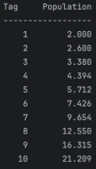

# Kapitel 1 Aufgabe 3
Schreiben Sie ein Programm, das die ungefähre Größe einer Population von Organismen vorhersagt. Die Anwendung sollte Textfelder verwenden, um dem Benutzer die Eingabe der Startanzahl von Organismen, des durchschnittlichen täglichen Populationswachstums (als Prozentsatz) und der Anzahl der Tage, an denen sich die Organismen vermehren sollen, zu ermöglichen. Beispielsweise nehmen wir an, der Benutzer gibt die folgenden Werte ein:

Anfangszahl der Organismen: 2 
 Durchschnittliche tägliche Zunahme in %: 30 
 Anzahl der Vermehrungstage: 10 

Das Programm sollte dann eine Ausgabe ähnlich der folgenden anzeigen:

