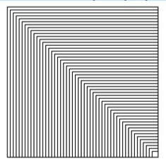

# Kapitel 1 Aufgabe 4
In Kapitel 1 gibt es ein Beispiel, wie man imit Turtle Graphics ein Quadrat mit Hilfe einer Schleife zeichnen kann. Schreiben Sie ein Programm, welches mit Hilfe einer verschachtelten Schleife 100 Quadrate zeichnet, die folgende Figur ergeben.

