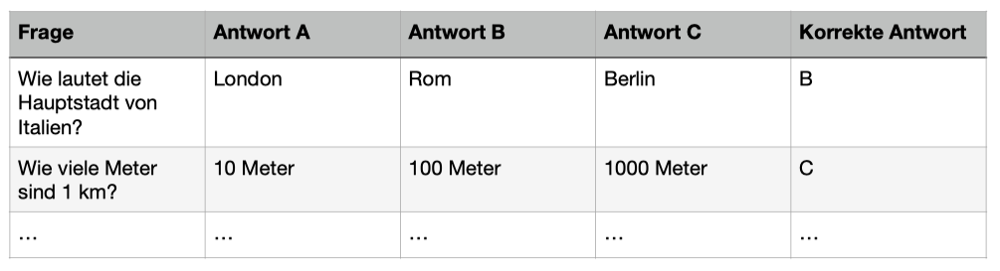

# Kapitel 4 Aufgabe 1
Sie sollen ein Programm entwerfen, das dem Nutzer / der Nutzerin Multiple-Choice-Fragen präsentieren und die Antworten auswerten kann. Die Fragen und Antworten liegen Ihnen in der folgende Struktur als Tabelle vor:
Schreiben Sie ein Programm, das Listen und Funktionen nutzt und der Nutzerin oder dem Nutzer nacheinander die Fragen mit den möglichen Antworten zur Auswahl präsentiert, die Eingabe des Lösungsbuchstabens abfragt und auswertet, wie viel % der Antworten richtig beantwortet wurden.

Schreiben Sie ein Programm, das Listen und Funktionen nutzt und der Nutzerin oder dem Nutzer nacheinander die Fragen mit den möglichen Antworten zur Auswahl präsentiert, die Eingabe des Lösungsbuchstabens abfragt und auswertet, wie viel % der Antworten richtig beantwortet wurden.
